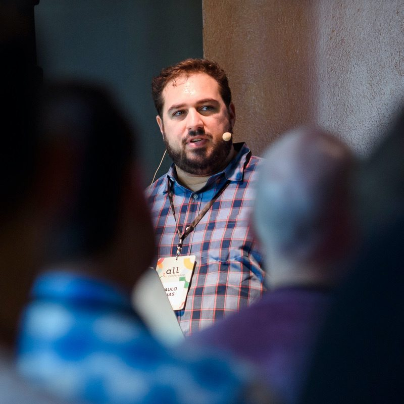

CraftCMS is an amazing CMS for developers and content editors that allows us to manage content for more than just websites. Craft coupled with today's modern javascript frameworks like React, React Native, or Vue, can provide developers with a ton of power and flexibility to deliver native mobile apps, PWAs (progressive web apps), or SPAs (single page apps). In this talk we'll see what it takes to build a SPA using Craft, GraphQL, and React.
